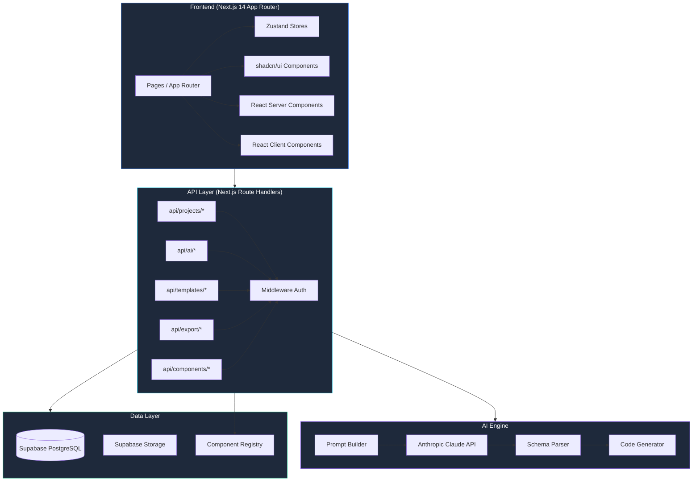
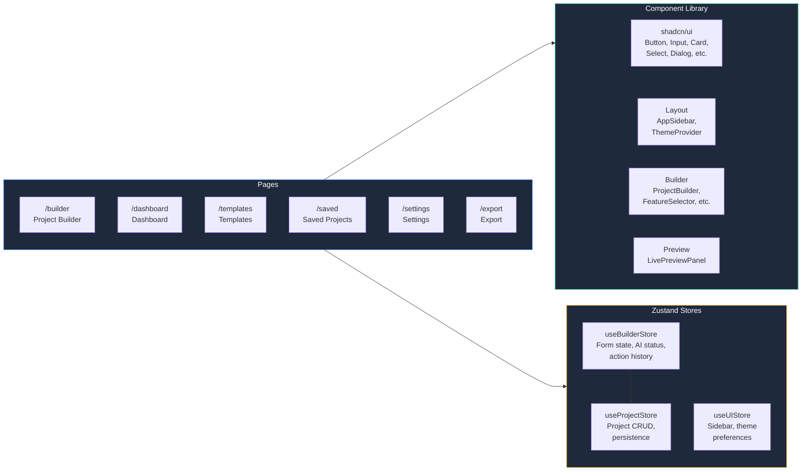
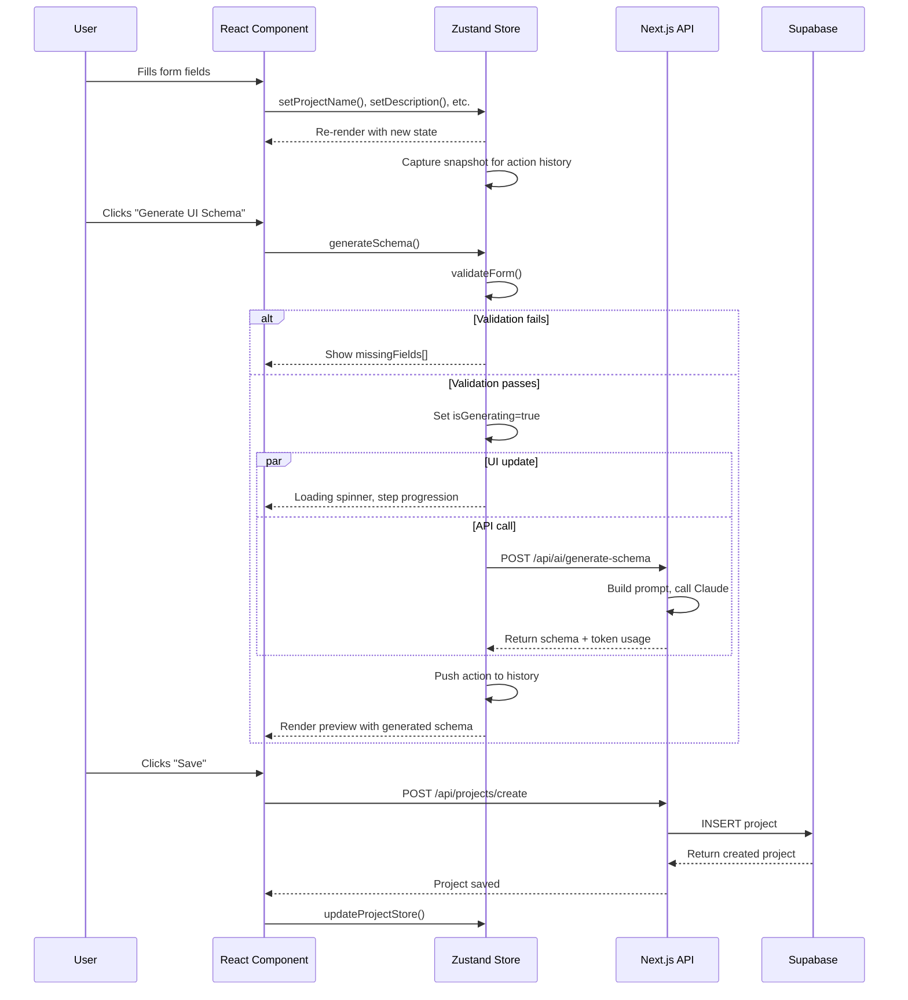
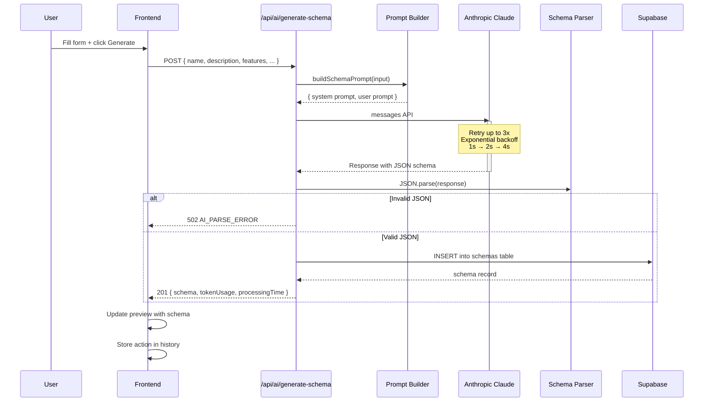

# S P Associates — System Architecture

## 1. System Architecture



### Component Diagram



---

## 2. API Routes Design

### Route Structure

```
/api
├── /projects
│   ├── POST   /create              Create a new project
│   ├── GET    /[id]                Get project by ID
│   ├── PUT    /[id]                Update project
│   ├── DELETE /[id]                Delete project
│   └── GET    /user/[userId]       List user's projects (paginated)
│
├── /ai
│   ├── POST   /generate-schema     Generate UI schema via Claude
│   ├── POST   /generate-code       Generate code from schema
│   └── POST   /regenerate          Regenerate with variation/feedback
│
├── /templates
│   ├── GET    /                    List templates (filtered, paginated)
│   └── GET    /[id]                Get template by ID
│
├── /export
│   ├── POST   /react               Export as React component
│   ├── POST   /html                Export as HTML document
│   └── POST   /pdf                 Export as PDF specification
│
└── /components
    └── GET    /registry            List available components
```

### Health Check (Root)

```
GET /api
→ { status: "ok", name: "SP Associates - AI Software Solution Configurator", version: "0.1.0" }
```

---

## 3. Request/Response Schemas

All schemas are defined in [lib/schemas.ts](lib/schemas.ts) using Zod.

### POST /api/projects/create

```typescript
// Request
{
  name: string              // required, max 200
  description: string       // required, max 5000
  targetAudience: string    // required, max 500
  location?: string         // optional, max 200
  applicationType: enum     // Website | CRM | ERP | Mobile App | SaaS Platform
  features: string[]        // required, min 1
  theme: enum               // corporate-blue | dark-mode | minimal-white | neon-gradient | custom-brand
  customColors?: {          // required if theme === "custom-brand"
    primary: string         // hex #RRGGBB
    secondary: string       // hex #RRGGBB
    accent: string          // hex #RRGGBB
    background: string      // hex #RRGGBB
  }
}

// Response 201
{
  id: string                // uuid
  name: string
  description: string
  targetAudience: string
  location: string
  applicationType: string
  features: string[]
  theme: string
  customColors: { ... } | null
  userId: string            // uuid
  createdAt: string         // ISO datetime
  updatedAt: string         // ISO datetime
}
```

### GET /api/projects/:id

```typescript
// Response 200
{
  id: string
  name: string
  description: string
  // ... full project object
}

// Response 404
{ error: { code: "NOT_FOUND", message: "Project not found" } }
```

### PUT /api/projects/:id

```typescript
// Request (all fields optional, partial update)
{
  name?: string
  description?: string
  features?: string[]
  theme?: string
  // ... any subset of CreateProject fields
}

// Response 200 — full updated project
```

### DELETE /api/projects/:id

```typescript
// Response 200
{ success: true }
```

### GET /api/projects/user/:userId

```typescript
// Query params
page?: number     // default 1
pageSize?: number // default 20
sortBy?: string   // default "updated_at"
sortOrder?: "asc" | "desc"  // default "desc"
status?: string   // optional filter

// Response 200
{
  projects: Project[]
  total: number
  page: number
  pageSize: number
}
```

### POST /api/ai/generate-schema

```typescript
// Request
{
  projectId?: string        // uuid, optional — links to existing project
  name: string              // required
  description: string       // required
  targetAudience: string    // required
  location?: string
  applicationType: enum
  features: string[]        // min 1
  theme: enum
  customColors?: CustomColors
  variation?: "layout" | "modern" | "conservative"  // default "layout"
}

// Response 201
{
  id: string                // schema uuid
  projectId: string | null
  schema: Record<string, any>  // JSON UI schema
  tokenUsage: {
    input: number
    output: number
    total: number
  }
  processingTimeMs: number
  variation: string
  createdAt: string
}
```

### POST /api/ai/generate-code

```typescript
// Request
{
  schemaId: string          // uuid
  framework: "react" | "nextjs" | "html"
  minify?: boolean          // default false
}

// Response 200
{
  code: string              // generated source code
  framework: string
  tokenUsage: { input, output, total }
}
```

### POST /api/ai/regenerate

```typescript
// Request
{
  projectId: string         // uuid
  schemaId: string          // uuid — previous schema to base on
  variation: "layout" | "modern" | "conservative"
  feedback?: string         // max 1000, optional user feedback
}

// Response 201 — same shape as generate-schema response

// Variation hints:
//   layout:      "Completely restructure the layout"
//   modern:      "Modern design, glassmorphism, rounded corners"
//   conservative: "Clean, traditional layout"
```

### GET /api/templates

```typescript
// Query params
type?: string      // filter by application type
search?: string    // search by name
page?: number
pageSize?: number

// Response 200
{
  templates: Array<{
    id: string
    name: string
    description: string
    type: string
    features: string[]
    theme: string
    popularity: number
    createdAt: string
  }>
  total: number
}
```

### GET /api/templates/:id

```typescript
// Response 200 — full template with schema
```

### POST /api/export/react

```typescript
// Request
{
  projectId: string
  schemaId: string
  options?: {
    typescript?: boolean     // default true
    styling?: "tailwind" | "css-modules" | "styled-components"  // default "tailwind"
    includeTests?: boolean   // default false
  }
}

// Response 200
{
  url: string               // Supabase Storage public URL
  fileName: string
  size: number              // bytes
  expiresAt: string         // ISO datetime, 7 days
}
```

### POST /api/export/html

```typescript
// Request
{
  projectId: string
  schemaId: string
  options?: {
    inlineCss?: boolean     // default true
    responsive?: boolean    // default true
  }
}

// Response 200 — same as export/react shape
```

### POST /api/export/pdf

```typescript
// Request
{
  projectId: string
  schemaId: string
  options?: {
    format?: "a4" | "letter"  // default "a4"
    includeCode?: boolean     // default false
  }
}

// Response 200
{
  url: string               // HTML pre-formatted for PDF
  fileName: string
  size: number
  expiresAt: string
}
// Note: Returns HTML styled for PDF conversion. Use a headless browser
// (Puppeteer/Playwright) server-side to convert to actual PDF.
```

### GET /api/components/registry

```typescript
// Query params
category?: string    // filter by: layout | navigation | forms | widgets | data

// Response 200
{
  components: Array<{
    id: string
    name: string
    category: string
    description: string
    props: Record<string, PropDefinition>
    version: string
  }>
}
```

### Error Response Format (all endpoints)

```typescript
{
  error: {
    code: string          // machine-readable error code
    message: string       // human-readable message
    details?: any         // optional validation errors
  }
}

// Common error codes:
// VALIDATION_ERROR — 400 — Zod validation failed
// UNAUTHORIZED     — 401 — Missing/invalid auth token
// FORBIDDEN        — 403 — Cannot access resource
// NOT_FOUND        — 404 — Resource does not exist
// DB_QUERY_ERROR   — 500 — Database query failure
// DB_INSERT_ERROR  — 500 — Database insert failure
// AI_PARSE_ERROR   — 502 — AI returned invalid JSON
// STORAGE_ERROR    — 500 — Supabase Storage failure
// INTERNAL_ERROR   — 500 — Unexpected error
```

---

## 4. State Management Flow

### Zustand Store Hierarchy

```
useUIStore           useBuilderStore        useProjectStore
  sidebarOpen          projectName             projects[]
  theme                description             currentProject
  toggleSidebar        features[]              addProject()
  setTheme             theme                   updateProject()
                       customColors            setCurrentProject()
                       isGenerating
                       actionHistory        ─── syncs to ───► Supabase
                       generateSchema()
                       undo()
                       validateForm()
```

### Data Flow



### Optimistic Updates Pattern

For mutations that benefit from instant UI feedback:

```typescript
// Example: Delete project with optimistic removal
async function deleteProject(id: string) {
  const previousProjects = useProjectStore.getState().projects;

  // 1. Optimistically remove from UI
  useProjectStore.getState().removeProject(id);

  try {
    // 2. Fire actual API call
    const res = await fetch(`/api/projects/${id}`, { method: "DELETE" });
    if (!res.ok) throw new Error("Delete failed");
  } catch {
    // 3. Rollback on failure
    useProjectStore.getState().setProjects(previousProjects);
  }
}
```

### Sync Strategy

| Direction | Mechanism | Notes |
|-----------|-----------|-------|
| Store → API | Explicit save (button click) | No auto-sync; user controls persistence |
| API → Store | Fetch on page load | `useEffect` in layout/page components |
| Store → URL | `next/navigation` searchParams | Optional: serialize form state to URL for shareable links |
| API → DB | Supabase client in route handlers | Row-Level Security enforced by user_id |

---

## 5. AI Orchestration Flow

### Generation Pipeline



### Retry Logic (Exponential Backoff)

```
Attempt 1:  wait 0s
Attempt 2:  wait 2s
Attempt 3:  wait 4s
Max 3 attempts, then throw

Retry triggers:
  - Network errors (fetch fails)
  - HTTP 5xx responses
  - Rate limiting (HTTP 429)
Does NOT retry on:
  - HTTP 4xx (bad request, auth failure)
  - Invalid JSON response (returns 502 to client)
```

### Temperature Configuration

| Operation | Temperature | Rationale |
|-----------|-------------|-----------|
| Initial schema generation | 0.3 | Consistent, predictable output |
| Regenerate — "modern" | 0.7 | Allow creative divergence |
| Regenerate — "conservative" | 0.3 | Stay close to original |
| Regenerate — "layout" | 0.5 | Moderate creativity |
| Code generation | 0.1 | Deterministic, correct syntax |
| PDF export | 0.1 | Accurate data rendering |

### Prompt Structure

The system prompt enforces JSON-only output:

```
System: You are an expert UI/UX architect. Generate a complete
JSON UI schema for the given application. Output ONLY valid
JSON with no markdown formatting or explanation.
```

Expected schema structure:

```json
{
  "layout": { "type": "string", "columns": 3 },
  "navigation": {
    "type": "top" | "sidebar",
    "items": [{ "label": "Home", "href": "/" }]
  },
  "pages": [
    {
      "name": "Home",
      "path": "/",
      "sections": [
        { "type": "hero", "title": "Welcome", "content": {} }
      ]
    }
  ],
  "components": [
    { "id": "hero-1", "type": "HeroSection", "props": {} }
  ],
  "theme": {
    "colors": {},
    "typography": {},
    "spacing": {}
  }
}
```

---

## 6. Database Schema (Supabase/PostgreSQL)

```sql
-- Projects table
CREATE TABLE projects (
  id            UUID PRIMARY KEY DEFAULT gen_random_uuid(),
  user_id       UUID NOT NULL REFERENCES auth.users(id),
  name          TEXT NOT NULL,
  description   TEXT NOT NULL,
  target_audience TEXT NOT NULL,
  location      TEXT DEFAULT '',
  application_type TEXT NOT NULL,
  features      JSONB NOT NULL DEFAULT '[]',
  theme         TEXT NOT NULL DEFAULT 'corporate-blue',
  custom_colors JSONB,
  status        TEXT DEFAULT 'draft',
  created_at    TIMESTAMPTZ DEFAULT NOW(),
  updated_at    TIMESTAMPTZ DEFAULT NOW()
);

CREATE INDEX idx_projects_user_id ON projects(user_id);
CREATE INDEX idx_projects_updated_at ON projects(updated_at DESC);

-- Schemas table (generated UI schemas)
CREATE TABLE schemas (
  id                UUID PRIMARY KEY DEFAULT gen_random_uuid(),
  project_id        UUID REFERENCES projects(id) ON DELETE CASCADE,
  user_id           UUID NOT NULL,
  schema            JSONB NOT NULL,
  token_usage       JSONB,
  processing_time_ms INTEGER,
  variation         TEXT DEFAULT 'layout',
  parent_schema_id  UUID REFERENCES schemas(id),
  created_at        TIMESTAMPTZ DEFAULT NOW()
);

CREATE INDEX idx_schemas_project_id ON schemas(project_id);

-- Templates table
CREATE TABLE templates (
  id          UUID PRIMARY KEY DEFAULT gen_random_uuid(),
  name        TEXT NOT NULL,
  description TEXT NOT NULL,
  type        TEXT NOT NULL,
  features    JSONB DEFAULT '[]',
  theme       TEXT DEFAULT 'corporate-blue',
  schema      JSONB,
  popularity  INTEGER DEFAULT 0,
  created_at  TIMESTAMPTZ DEFAULT NOW()
);
```

---

## 7. Security & Auth

- All API routes (except `/api` health check) require authentication
- Auth is validated via Bearer token (JWT) in the `Authorization` header
- Row-Level Security (RLS) in Supabase enforces user-level data isolation
- All queries filter by `user_id` to prevent data leaks
- API keys stored in `.env.local`, never exposed to the client
- CORS is handled by Next.js natively (same-origin by default)
